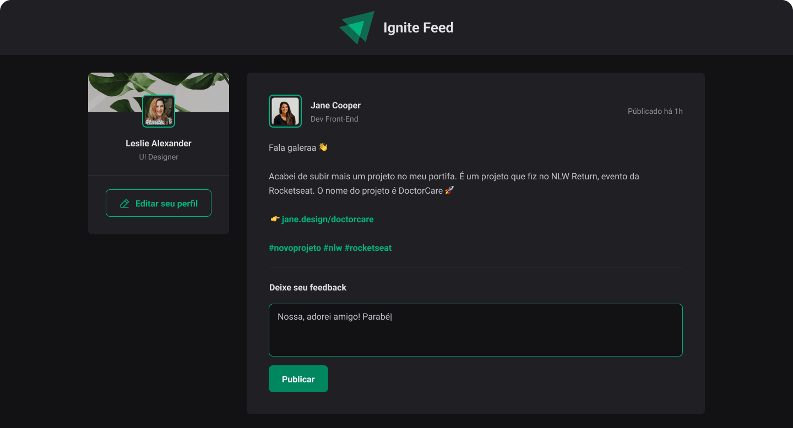

# Feed



## Sobre

Esse é um projeto simples de um chat, que foi construído para treinar conceitos básicos do React como estados e construção de interfaces.

## Instalação

```bash
git clone https://github.com/manoguii/feed.git
```

- Para rodar o projeto localmente
  1. Instale as dependências ```npm install```
  2. Execute a aplicação. ```npm run dev```
  3. Acesse `http://localhost:3000`

## Tecnologias

Algumas tecnologias utilizadas para construção da aplicação.

- [ReactJS](https://reactjs.org/)
- [TypeScript](https://www.typescriptlang.org/)
- Vite

---

<center>Made with 💙 by Guilherme David</center>
